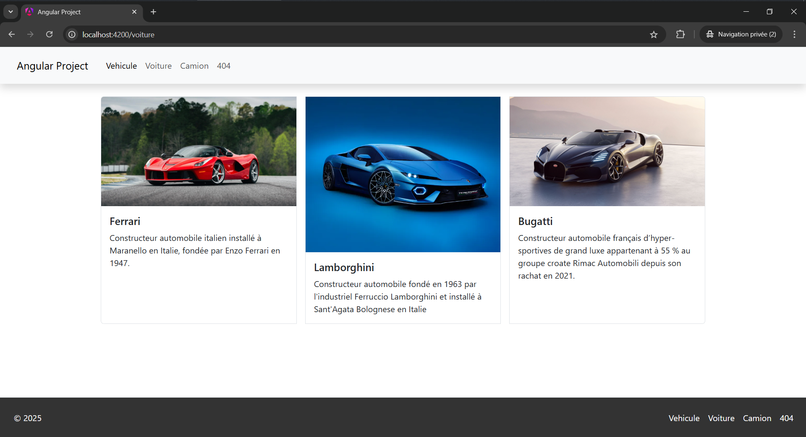

# angular-project
Projet angular effectué lors de la POEC java / angular 2024  

Pour lancer le projet :

1/ Se rendre sur le dossier "back" et lancer la commande suivante :

npx json-server db.json

2/ Se rendre sur le dossier "front" et lancer la commande suivante :

ng serve

3/ Enfin, ouvrir : http://localhost:4200/